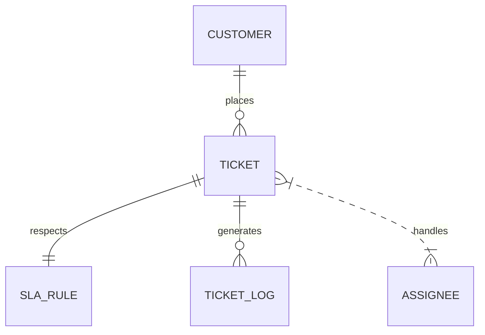
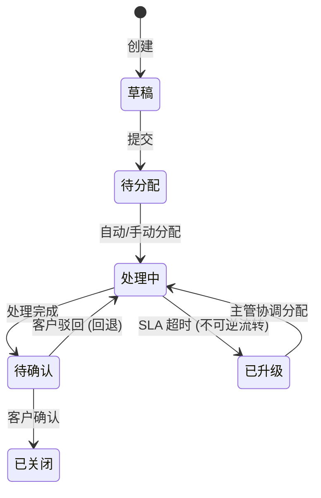
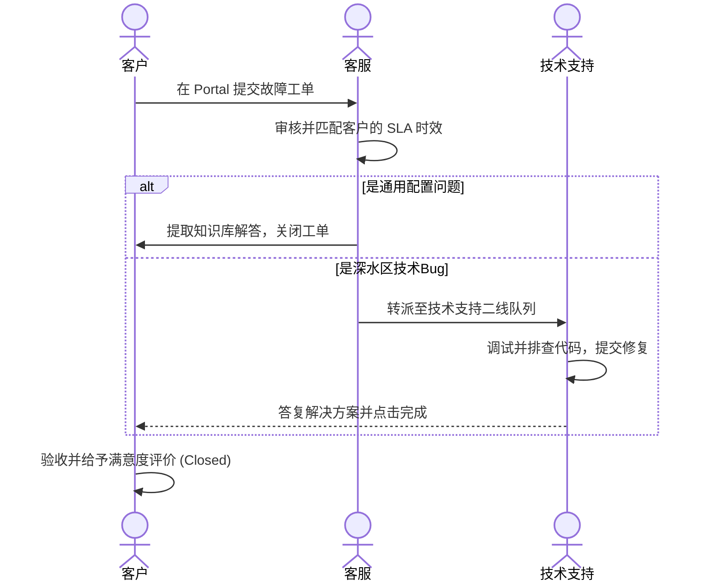

# 工单系统分析示例

> 本示例展示使用 biz-analysis Skill 分析「SaaS客服工单系统」的完整过程。

---

## 用户输入

```
我们是一家SaaS公司，客服团队现在用微信群+Excel管理客户工单。
效率很低，经常漏单，客户投诉响应慢。
想要一个工单管理系统，能自动分配、跟踪SLA、跨部门协作。
目前已用企业微信和用友U8 ERP。
```

---

## Phase 1: 资料接入与清洗

### 输入评估
- ✅ 业务背景：SaaS客服团队，微信群+Excel管理，效率低、漏单、响应慢
- ✅ 涉及角色：客服（隐含）
- ⚠️ 核心流程：仅有模糊描述「自动分配、跟踪SLA、跨部门协作」
- ❌ 业务规则：未提及
- ✅ 已有系统：企业微信、用友U8 ERP

→ 部分充分（3/5），需要补充核心流程和业务规则

### 补充提问（P1-步骤末）
```
我需要补充几个关键信息：
1. 工单由谁创建？（客户自行提交 / 客服代建 / 两种都有？）
2. 「跨部门协作」具体指什么场景？（技术支持、运维、产品？）
3. SLA 的具体标准是什么？（如：响应时间<2h，解决时间<24h？）
```

### 用户回答
```
1. 两种都有，客户可以在portal提交，客服也可以代建
2. 主要是转给技术支持团队处理技术问题
3. SLA目前没有标准，希望系统能帮我制定
```

### 业务上下文输出
```json
{
  "业务背景": "某SaaS企业客服团队，当前使用微信群+Excel管理客户工单，效率低、无法追踪SLA",
  "业务目标": ["建立统一工单管理平台", "实现SLA自动监控与预警", "支持工单跨部门流转"],
  "当前痛点": ["工单分散在微信、邮件、Excel，无法统一追踪", "无SLA概念，客户投诉响应慢", "跨部门协作靠人工@，无自动流转"],
  "已有系统": ["企业微信", "用友U8 ERP"],
  "涉及角色": ["客服", "技术支持", "客户", "管理员"],
  "核心流程": ["客户/客服创建工单", "管理员/自动分配工单", "处理人处理工单", "SLA监控与预警", "工单关闭与回访"],
  "业务规则": ["SLA标准待制定", "支持portal自提交和客服代建", "技术支持处理技术问题"],
  "ddd_bounded_contexts": [
    {
      "name": "SLA-Monitoring",
      "description": "SLA rules management and ticket timeout detection.",
      "type": "core"
    },
    {
      "name": "Ticket-Management",
      "description": "Standard ticket CRUD and routing logic.",
      "type": "supporting"
    },
    {
      "name": "Tenant-Roles",
      "description": "Tenant roles and permissions control.",
      "type": "generic"
    }
  ]
}
```

### HARD-GATE 确认
向用户展示以上上下文 → 用户确认 ✅

---

## Phase 2: 业务理解与建模

### 行业识别
🟢 高置信度：SaaS服务业 / 工单管理系统
依据：明确提到「SaaS企业」「客服团队」「工单」

### 领域模型与核心实体 (DDD 战术分类)
| 类别 | 实体名 | 说明 | 关键属性 | 置信度 |
|---|---|---|---|---|
| 聚合根 | 工单 (Ticket) | 核心业务单元，拥有独立标识与生命周期 | id, ticket_no, title, type, priority, status | 🟢高 |
| 聚合根 | 客户 (Customer) | 租户层客户主体，在 ERP 中有对应映射 | id, name, level (VIP/Normal), email | 🟢高 |
| 实体 | 处理人 (Assignee) | 内部协同处理人员，从属于技能组 | id, name, department_id, skills | 🟢高 |
| 聚合根 | SLA规则 (SlaRule) | 时效配置策略，独立于工单生命周期 | id, name, response_hours, resolve_hours | 🟡中 |
| 值对象 | 工单日志 (TicketLog) | 依附于工单聚合根的数据留痕，不可修改 | id, action, content, operator_id, created_at | 🟢高 |

### 实体关系图 (Mermaid ERD)


### 核心状态机 (Mermaid State Chart)


### 时序协作流程图 (Mermaid Sequence)


### 角色权限配置 (RBAC)
| 角色 | 权限范围 | 数据隔离维度 |
|---|---|---|
| 客户 | 创建自己的工单、查看/跟进/确认/评价个人工单 | 个人/租户级数据隔离 |
| 客服 | 创建/分配/转派/关闭所有普通工单 | 跨部门查看，无系统配置权限 |
| 技术支持 | 接收/处理分配给自己的技术类工单，提交升级申请 | 本人及技能组内数据隔离 |
| 管理员 | SLA规则管理、微服务架构配置、统计分析、全部权限 | 跨租户跨系统全局可见 |

### HARD-GATE 确认
向用户展示业务模型（包含 DDD 限界上下文、三种 Mermaid 图、实体与值对象分类及 RBAC 矩阵） → 用户确认 ✅

---

## Phase 3: 功能拆解与优先级

### 功能清单

| 模块 | 功能点 | 角色 | 优先级 | 用户故事与 Gherkin 验收标准 (BDD) |
|---|---|---|---|---|
| 工单管理 | 创建工单 | 客户/客服 | P0-Must | 作为客服，我希望快速创建工单以便记录客户问题。<br>**AC:**<br>Given 客服登录系统进入创建工单页<br>When 录入标题 "订单支付失败" 并选择客户<br>Then 成功创建状态为 "待分配" 的工单。 |
| 工单管理 | 分配工单 | 管理员 | P0-Must | 作为管理员，我希望自动/手动分配工单。<br>**AC:**<br>Given 存在待分配工单<br>When 系统轮询可用客服，或管理员手动指派<br>Then 工单状态变更为 "处理中"，并向处理人发送企微通知。 |
| 工单管理 | 转派工单 | 客服/处理人 | P1-Should | 作为处理人，我希望转派工单给其他同事。 |
| 工单管理 | 工单时间线 | 所有角色 | P1-Should | 作为用户，我希望查看工单处理全过程。 |
| SLA管理 | SLA规则配置 | 管理员 | P0-Must | 作为管理员，我希望配置不同类型的SLA标准。 |
| SLA管理 | SLA监控 | 系统 | P0-Must | 作为系统，我需要自动监控工单是否超时。<br>**AC:**<br>Given 系统中存在处理时长 > 24小时的 "处理中" 工单<br>When SLA 定时任务触发检测<br>Then 系统自动触发预警，发送企业微信给客服主管，且工单标记为 "已升级"。 |
| SLA管理 | 超时预警 | 系统/主管 | P0-Must | 作为主管，我希望收到即将超时的工单预警。 |
| 统计报表 | SLA达标率 | 主管 | P1-Should | 作为主管，我希望查看团队SLA达标率。 |
| 知识库 | 方案推荐 | 处理人 | P2-Could | 作为处理人，我希望系统推荐相似解决方案。 |

### 功能树
```
工单管理系统
├── 工单管理 [P0]
│   ├── 创建工单 [P0]
│   ├── 分配工单 [P0]
│   ├── 转派工单 [P1]
│   ├── 关闭工单 [P0]
│   └── 工单时间线 [P1]
├── SLA管理 [P0]
│   ├── SLA规则配置 [P0]
│   ├── SLA监控 [P0]
│   └── 超时预警 [P0]
├── 统计报表 [P1]
│   ├── SLA达标率 [P1]
│   └── 工单趋势 [P1]
├── 知识库 [P2]
│   └── 方案推荐 [P2]
└── 系统设置 [P1]
    ├── 角色权限 [P1]
    └── 数据字典 [P1]
```

### MVP 定义
P0 功能 = MVP：创建工单、分配工单、关闭工单、SLA规则配置、SLA监控、超时预警

### 回溯检查
✅ 所有已识别流程（创建→分配→处理→关闭→SLA监控）都有对应功能覆盖

### HARD-GATE 确认
向用户展示功能清单 → 用户确认 ✅（用户补充：增加「满意度评价」功能，P1）

---

## Phase 4: 风险扫描

### 高风险项
| 风险维度 | 影响与隐患 | 架构建议与防灾方案 |
|---|---|---|
| **集成容灾风险 (ERP)** | 工单需要同步集成用友 U8 客户信息，若 ERP 系统不可用，可能导致工单创建阻塞。 | **重试与降级**：设计本地客户数据缓存 Redis，当 U8 接口超时或宕机时，降级读取本地缓存并发出降级告警；设计异步补偿机制，待 ERP 恢复后同步脏数据。 |
| **安全与脱敏风险 (合规)** | 客服代建及客户提单会涉及真实手机号与邮箱，有敏感信息泄漏隐患。 | **行级隔离与列级脱敏**：采用 RBAC 严格隔离部门与租户数据。针对联系方式（手机号、邮箱）进行**列级屏蔽**（前端进行如 `138****8888` 遮蔽处理），后端仅允许拥有敏感数据查看权限的主管一键解密审计。 |
| **幂等性风险 (高并发)** | 客户在 Portal 创建工单时，可能由于网络卡顿高频快速点击，导致后台产生多张重复垃圾工单。 | **接口防重幂等**：写工单接口强制要求前端在 Header 携带防重令牌 (Token) 或**幂等性密钥 (Idempotency Key)**，后端基于 Redis SetNX 执行 5 秒锁定拦截。 |

### 缺失需求（AI推导）
| 缺失项 | 原因 | 优先级 | 置信度 |
|---|---|---|---|
| 工单防重复提交 | 客户可能重复提交 | P0-Must | 🟡中 |
| 审批人离职自动转派 | 避免工单卡死 | P1-Should | 🟡中 |
| 满意度回访 | 行业标准闭环 | P1-Should | 🔴低 |
| 工单 re-open | 客户可能追加反馈 | P1-Should | 🟡中 |

### 异常场景
- 处理人请假 → 自动转派给同组其他成员
- 接口失败 → 重试3次后告警，不阻塞主流程
- 重复提交 → 相似工单检测，提示用户

### HARD-GATE 确认
向用户展示风险评估 → 用户确认 ✅（采纳：防重复提交、re-open；忽略：满意度回访）

---

## Phase 5: 系统设计

### 数据模型
| 表 | 说明 | 关键字段 |
|---|---|---|
| ticket | 工单主表 | id, ticket_no, title, type, priority, status, source, customer_id, assignee_id, sla_rule_id |
| ticket_log | 工单日志 | id, ticket_id, operator_id, action, content, created_at |
| sla_rule | SLA规则 | id, name, level, response_hours, resolve_hours |
| sla_event | SLA事件 | id, ticket_id, event_type, trigger_time |

### API 建议 (包含 OpenAPI 3.0 YAML)
| 方法 | 路径 | 描述 | 调用角色 |
|---|---|---|---|
| POST | /api/v1/tickets | 创建工单 | 客户/客服 |
| GET | /api/v1/tickets | 查询工单列表 | 客服/处理人 |
| PUT | /api/v1/tickets/{id}/assign | 分配工单 | 管理员 |
| PUT | /api/v1/tickets/{id}/transfer | 转派工单 | 处理人 |
| PUT | /api/v1/tickets/{id}/close | 关闭工单 | 处理人 |

在 `analysis-data.json` 的 `openapi_spec_yaml` 字段中已实装标准 YAML 格式：
```yaml
openapi: 3.0.3
info:
  title: SaaS 客服工单 API
  version: 1.0.0
paths:
  /api/v1/tickets:
    post:
      summary: 创建客服工单
      x-actor: 客户/客服
      requestBody:
        required: true
        content:
          application/json:
            schema:
              type: object
              required: [title, customer_id]
              properties:
                title:
                  type: string
                customer_id:
                  type: integer
      responses:
        '201':
          description: Created
```

### 集成架构
| 对接系统 | 方式 | 数据流向 | 容灾防守方案 |
|---|---|---|---|
| 企业微信 | 异步Webhook | 本系统→企微（通知） | 消息队列缓冲，失败自动指数级重试 5 次并告警 |
| U8 ERP | 同步API+缓存 | ERP→本系统（客户） | 本地 Redis 缓存降级，隔夜执行批量一致性对账对齐 |

### HARD-GATE 确认
向用户展示系统设计 → 用户确认 ✅

---

## Phase 6: 生成分析报告

### 完成度评分

| 维度 | 得分 | 说明 |
|---|---|---|
| 输入充分度 | 16/20 | 缺少「业务规则约束」详细输入 |
| 分析覆盖率 | 28/30 | 95%流程已覆盖 |
| 风险识别率 | 22/25 | 高风险1项有方案，3项缺失需求已确认 |
| 行业对标度 | 18/25 | 覆盖75%行业标准功能，建议补充：批量操作、数据导出 |
| **总分** | **84/100** | |

### 产出文件与自动化 Schema 校验
* `ticket-system/analysis-report.md`
* `ticket-system/analysis-data.json`
* `ticket-system/feature-tree.txt`

在生成产物后，通过本地终端成功执行自动化校验脚本：
```bash
$ node scripts/validate_schema.js ticket-system/analysis-data.json
🟢 Schema validation successful! 所有字段、枚举值和引用完整性校验通过。
```

### 交接提示
分析完成。如需生成 PRD 和原型，可调用 `/pm-html-pdt-fused` 并引用 `ticket-system/analysis-data.json`。

---

## 附录 A：复杂场景示例

### 场景 1：P0 阻塞 — 矛盾信息处理

**背景**：在 Phase 2 分析中，用户说「工单只能由客服创建」，但之前的资料中提到「客户可以在 portal 提交工单」。

**Skill 处理方式**：
```
🔴 P0-阻塞：发现矛盾信息

您提到「工单只能由客服创建」，但之前的资料中描述了
「客户可以在 portal 提交工单」。这两种说法矛盾。

我的判断：两句话可能描述的是不同阶段——
初期只有客服代建，二期开放客户 portal。
但这只是推测，需要您明确。

请确认：
A) 两种方式都支持（客户 portal + 客服代建）
B) 仅客服代建（暂不开放 portal）
C) 其他情况请说明
```

**用户回答**：「A，两种都支持」

**后续**：Skill 更新实体关系和功能清单，继续推进。

---

### 场景 2：Phase 7 增量修正（纠错修正）

**背景**：Phase 6 完成后，用户发现「SLA 规则不是按工单类型配置的，是按客户等级配置的」。

**Skill 处理方式**：
```
📝 修正分析

修正内容：SLA 规则的匹配维度从「工单类型」改为「客户等级」
修正类型：纠错修正
影响范围：SLA 规则实体的关联关系改变

回溯分析：
- Phase 2 影响：SLA规则实体的 key_attributes 需修改，
  关系从 工单→SLA 改为 客户→SLA
- Phase 3 影响：SLA规则配置页面的表单字段需要修改
- Phase 4 影响：无新增风险
- Phase 5 影响：sla_rule 表的外键从 ticket_id 改为
  customer_level，API 参数需调整

执行计划：回溯 Phase 2，重跑 Phase 2-6
```

**重跑 Phase 2**（仅修改受影响部分）：
```
🟢 SLA 规则实体更新

原：SLA规则 ──N:1──→ 工单类型
新：SLA规则 ──N:1──→ 客户等级

属性变更：
- 移除：ticket_type_id
- 新增：customer_level（VIP/普通/试用）
- 新增：response_hours, resolve_hours（不变）

其余实体和关系不变。
```

**重跑 Phase 3**（仅修改 SLA 配置页面）：
```
SLA管理模块更新：
- SLA规则配置页面：表单字段从「工单类型」改为「客户等级」
- SLA监控逻辑不变（仍按工单关联的 SLA 规则检查超时）
- 新增逻辑：创建工单时，根据客户等级自动匹配 SLA 规则
```

**重跑 Phase 5**（仅修改数据模型）：
```
sla_rule 表更新：
- 移除：ticket_type_id
- 新增：customer_level VARCHAR ENUM('VIP','normal','trial')
- API 变更：POST /api/v1/sla-rules 请求参数调整
```

---

### 场景 3：大型系统分析要点

**背景**：分析一个覆盖采购、仓储、生产、销售的制造业 ERP 系统，功能点预计 >100。

**Skill 调整策略**：

1. **Phase 1 输入评估**：
   - 输入可能 >20 万字 → 启用分段读入策略
   - 先读目录和摘要，跳过详细字段定义
   - Phase 1 输出标注「未读取：XX文档的详细字段说明」

2. **Phase 2 分阶段建模**：
   - 按业务域分批建模：先采购域 → 再仓储域 → 再生产域 → 最后销售域
   - 每个域建模后做一次中间确认
   - 跨域关系（如采购→仓储→生产的物料流转）在各域完成后统一分析

3. **Phase 3 分层拆解**：
   - 先拆模块级（P0/P1/P2），再拆功能点
   - MVP 范围可能只覆盖 1-2 个核心域
   - 功能依赖分析重点关注跨域依赖

4. **Phase 4 风险扫描重点**：
   - 数据迁移风险：历史数据量大，需要专项方案
   - 接口依赖：多个子系统间集成复杂
   - 上线策略：建议分域上线，先核心域再辅助域

5. **预估时长**：40-60 分钟（建议分 2-3 次会话完成）

---

### 场景 4：HARD-GATE 死锁处理

**背景**：Phase 2 HARD-GATE，用户反复说「差不多」「应该没问题」但不明确确认。

**Skill 处理方式**：
```
📋 业务模型确认 (Phase 2/7)

[... 展示业务模型 ...]

🟡 这是第三次确认请求。

当前理解中：
✅ 确定的部分：4个核心实体、3条主流程、2个角色
❓ 待确认的部分：SLA规则实体（🟡中置信度）、
   跨部门协作流程（推导，🔴低置信度）

请明确选择：
A) 以上内容基本正确，继续 Phase 3
B) 请指出需要修改的具体内容
```

**如果用户仍不明确**：按 A) 处理，在最终报告的「待确认事项」中列出：
```
## 待确认事项

以下内容在分析过程中未获得用户明确确认，基于 AI 推导：
1. 🔴 SLA 规则实体定义（建议：由管理员确认 SLA 匹配维度）
2. 🔴 跨部门协作流程细节（建议：与技术支持团队确认升级规则）
```
