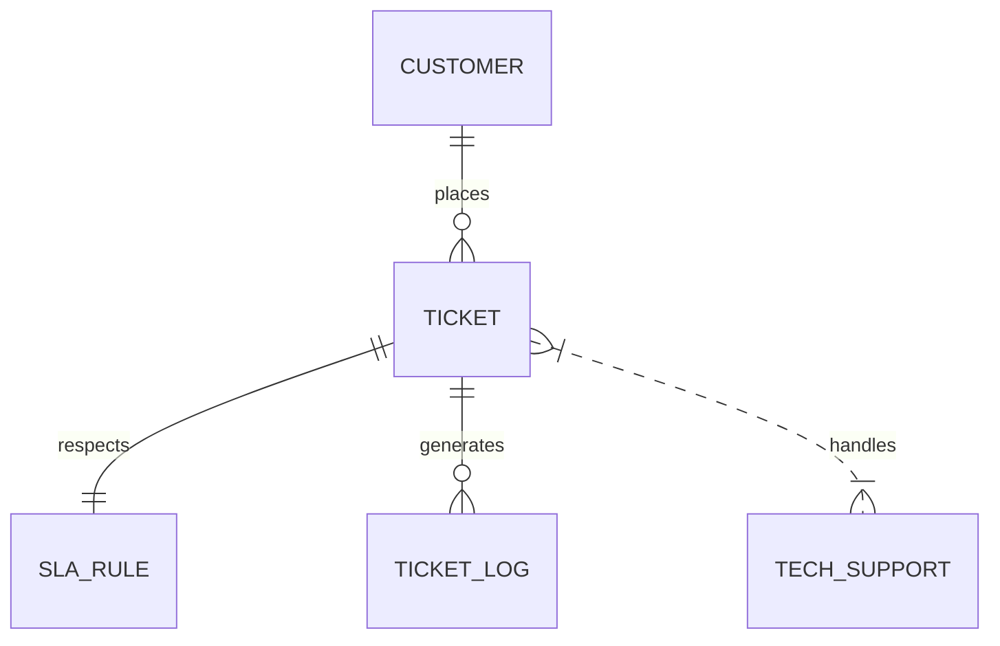
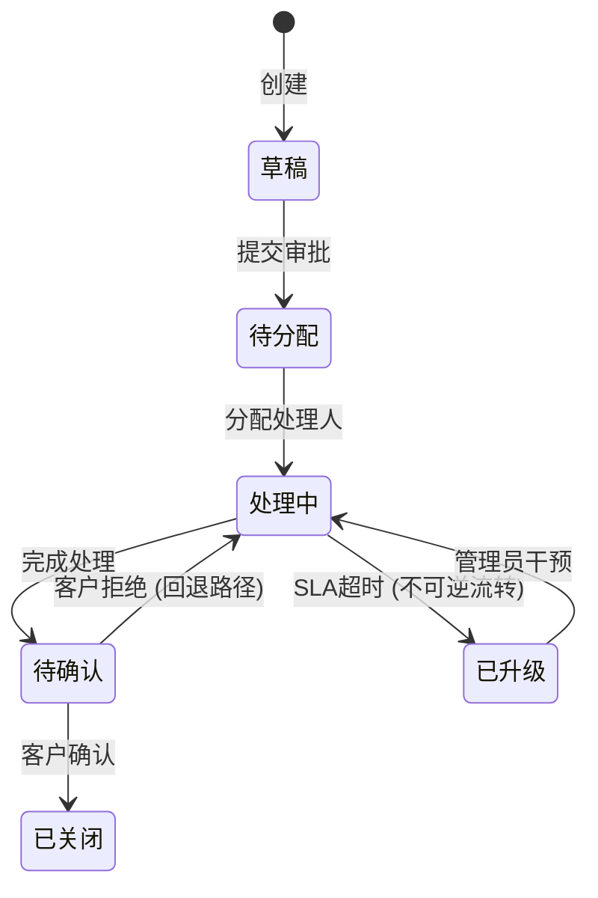
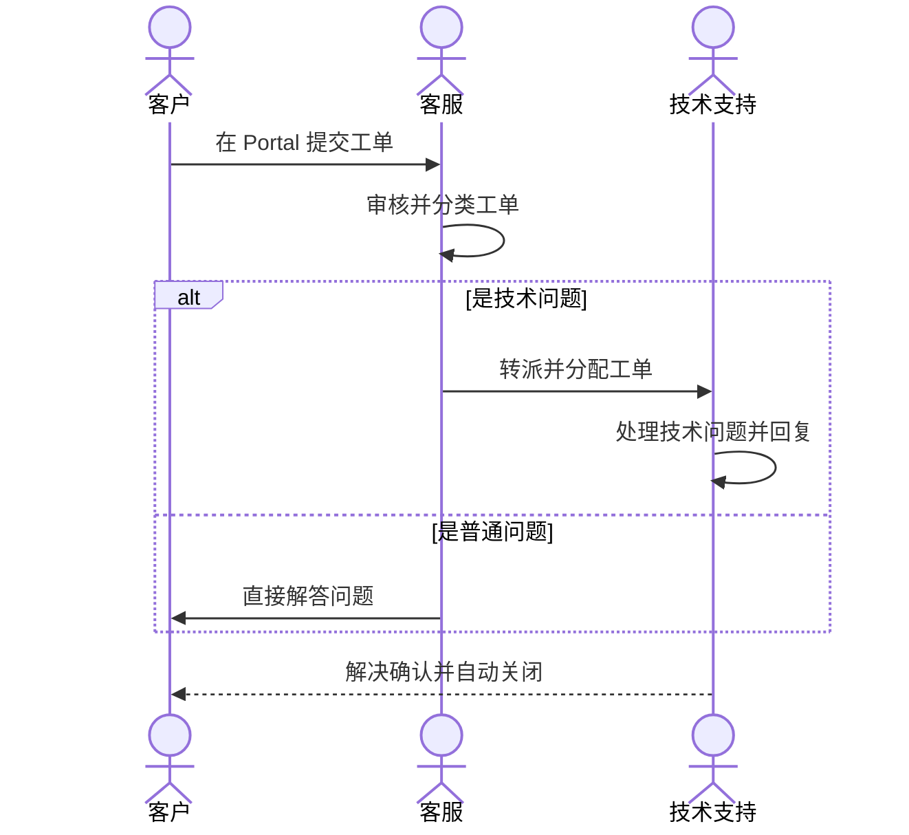

# Phase 1-3 分析方法论

> 本文件在 Phase 1/2/3 时加载，提供详细的方法论指导。

---

## Phase 1: 资料接入与清洗

### 1.1 输入评估

检查用户提供的资料覆盖以下 5 个关键维度：

| 维度 | 关键信息 | 缺失影响 |
|---|---|---|
| 业务背景 | 为什么要做这个系统、解决什么问题 | 无法判断优先级和范围 |
| 涉及角色 | 谁使用、谁管理、谁决策 | 无法分析权限和功能分配 |
| 核心流程 | 业务怎么运转、步骤是什么 | 无法拆解功能 |
| 业务规则 | 约束条件、审批规则、计算逻辑 | 功能设计缺少依据 |
| 已有系统 | 要对接什么、替换什么 | 无法评估集成复杂度 |

**充分度判定：**
- 5/5 维度有明确信息 → 充分，直接清洗
- 3-4/5 → 部分充分，列出缺失维度，引导补全
- <3/5 → 不充分，主动提问补全（使用追问策略）

### 1.2 资料清洗规则

1. **术语统一**：识别同义词并统一
   - 建立术语映射表：A=B=C → 统一为 A
   - 常见映射：客户=用户=商户、工单=Ticket、审批=审核
2. **去噪**：移除与业务无关的内容（寒暄、格式标记、重复标题）
3. **去重**：合并对同一事物的多次描述，保留最详细的版本
4. **合并**：多个来源描述同一实体/流程时，合并为完整描述

### 1.3 业务上下文提取模板

```json
{
  "业务背景": "<从资料中提取的背景描述>",
  "业务目标": ["<目标1>", "<目标2>"],
  "当前痛点": ["<痛点1>", "<痛点2>"],
  "已有系统": ["<系统1>", "<系统2>"],
  "涉及角色": ["<角色1>", "<角色2>"],
  "核心流程": ["<流程1>", "<流程2>"],
  "业务规则": ["<规则1>", "<规则2>"]
}
```

### 1.4 上下文确认交互模板

```
📋 业务上下文确认

我从你提供的资料中提取了以下信息：

**业务背景：** ...
**业务目标：** ...
**当前痛点：** ...
**已有系统：** ...
**涉及角色：** ...
**核心流程：** ...
**业务规则：** ...

请确认以上信息是否正确。如有遗漏或错误，请告诉我需要修正的地方。
```

---

## Phase 2: 业务理解与建模

### 2.0 领域驱动设计 (DDD) 思想引入（必填）

在进行具体建模前，必须先理清限界上下文与统一语言，避免大一统设计（Monolithic Design）带来的混乱：

1. **统一语言 (Ubiquitous Language)**：
   * 必须在术语表和实体名中完全使用统一语言（如：SaaS 服务业中的 "租户"、"订单"、"工单"，禁止中英文混用或概念漂移）。
2. **限界上下文 (Bounded Context) 划分**：
   * 针对大中型系统，将系统划分为多个松耦合的限界上下文：
     * **核心域 (Core Domain)**：系统的核心竞争力所在（如工单系统的 "SLA监控域"）。
     * **支撑域 (Supporting Domain)**：为核心域提供业务辅助（如 "工单管理域"、"客户管理域"）。
     * **通用域 (Generic Domain)**：通用的公共底层能力（如 "角色权限域"、"通知推送域"）。
   * 输出标准的 `ddd_bounded_contexts` 数组定义。

### 2.1 行业识别方法

**识别依据（按优先级）：**
1. 资料中明确提到的行业/系统类型 → 🟢高置信度
2. 核心实体和流程特征匹配 → 🟡中置信度
3. 行业类比推断 → 🔴低置信度

**常见 B 端系统类型：**
- ERP（企业资源计划）：核心实体=物料/订单/库存/财务/采购
- CRM（客户关系管理）：核心实体=客户/商机/合同/跟进记录
- SRM（供应商关系管理）：核心实体=供应商/采购单/招标/评估/框架协议
- OA（办公自动化）：核心实体=审批单/公告/日程/任务
- WMS（仓储管理）：核心实体=仓库/库区/库位/入库单/出库单/盘点单/移库单
- MES（制造执行）：核心实体=生产工单/工序/设备/产线/BOM/质检单/报废单
- 工单系统：核心实体=工单/处理人/SLA/知识库
- 电商后台：核心实体=商品/SPU/SKU/订单/支付/物流/售后/优惠券/活动

### 2.2 核心实体与值对象识别 (DDD 战术建模)

在 DDD 中，我们对识别出的对象进行分类，这决定了 Phase 5 的数据模型事务边界与主外键设计：
* **聚合根 (Aggregate Root) / 实体 (Entity)**：拥有唯一身份标识（ID），具有完整的生命周期和状态机，可以被独立操作（如：工单 `Ticket`、客户 `Customer`）。
* **值对象 (Value Object)**：没有独立身份标识，仅包含属性描述，通常依附于实体存在，是不可变的（如：工单的“收货地址” `Address`、SLA定义的“时效配置” `Duration`）。

**识别信号：**
- 反复出现的名词（出现3次以上）
- 有明确属性描述的事物（有字段、有状态）
- 有明确生命周期的事物（有创建→处理→完成）
- 有明确操作的事物（可以创建/编辑/删除/查询）

**实体属性提取：**
- 从资料中直接提到的字段
- 从流程中推断的必要字段（如：有审批→必须有状态字段）
- 从行业惯例推断的标准字段（如：订单→编号/金额/时间）
- 标注实体/聚合根在领域中的战术定位（是否为聚合根/值对象）

### 2.3 实体关系分析 (ERD)

**关系类型：**
- 1:1 — 一个工单对应一个SLA规则
- 1:N — 一个客户有多个工单
- N:M — 一个处理人处理多个工单，一个工单可被多人处理

**关系识别信号：**
- 「属于」→ 1:N
- 「关联」→ 需进一步判断
- 「包含」→ 1:N 或 N:M
- 「对应」→ 1:1 或 1:N

**Mermaid ER 图输出模板 (必填项)：**
Agent 必须在分析报告和阶段交付中提供标准的 Mermaid ERD 关系图：


### 2.4 状态机生成规则

**标准状态集（根据实体类型选择）：**

工单类实体：
`[草稿] → [待分配] → [处理中] → [待确认] → [已关闭]`

审批类实体：
`[草稿] → [待审批] → [审批中] → [已通过] / [已驳回]`

合同类实体：
`[草稿] → [审批中] → [生效中] → [已到期] / [已终止]`

采购单类实体（SRM）：
`[草稿] → [待审批] → [已批准] → [已下单] → [部分收货] → [已收货] → [已完成] / [已取消]`

入库单类实体（WMS）：
`[待入库] → [入库中] → [已入库] / [异常待处理] → [已入库]`

出库单类实体（WMS）：
`[待拣货] → [拣货中] → [已出库] / [异常待处理] → [已出库]`

生产工单类实体（MES）：
`[计划中] → [待排产] → [生产中] → [待质检] → [合格/不合格] → [已完工] / [已报废]`

订单类实体（电商）：
`[待付款] → [已付款] → [待发货] → [已发货] → [已签收] → [已完成] / [退款中] → [已退款]`

**状态流转规则：**
- 标注每个流转的触发条件
- 标注是否有不可逆状态（如：已归档不可回退）
- 标注是否有超时规则（如：48小时未处理自动升级）
- 标注是否有回退路径（如：审批驳回→回到草稿）

**Mermaid 状态机图输出模板 (必填项)：**
每一条生命周期状态机，Agent 必须在阶段交付中提供标准 Mermaid 状态图：


### 2.5 流程识别方法

**主流程**：业务的核心价值链路（如：客户提交工单→分配→处理→关闭）
**分支流程**：条件触发的替代路径（如：紧急工单直接升级）
**异常流程**：出错/超时/特殊场景（如：处理人请假→自动转派）
**审批流程**：需要审批节点的流程（如：金额>1万需要总监审批）

**流程识别信号：**
- 「然后」「接下来」→ 步骤顺序
- 「如果」「否则」→ 分支条件
- 「但是」「除非」→ 异常处理
- 「审批」「审核」→ 审批节点

**Mermaid 时序流程图输出模板 (必填项)：**
针对跨角色/跨系统的协作流程，Agent 必须在阶段交付中提供标准的泳道时序流程图：


### 2.6 角色与权限分析

**角色识别：**
- 从资料中直接提到的角色
- 从流程中推断的角色（谁执行什么操作）
- 从行业惯例推断的默认角色

**权限维度：**
- 菜单权限：每个角色能看哪些页面
- 按钮权限：每个角色能执行哪些操作
- 数据权限：每个角色能看哪些数据（全部/本部门/本人）
- 字段权限：每个角色能看/编辑哪些字段

### 2.7 价值流与数据流（简化版）

**价值流**：从客户视角，梳理端到端的价值创造过程
- 输入：客户的原始需求/问题
- 处理：内部的响应和处理过程
- 输出：问题解决/需求满足

**数据流**：数据在系统间如何流转
- 数据源头：谁产生数据
- 数据消费方：谁使用数据
- 流转方式：同步API / 异步消息 / 批量同步

---

## Phase 3: 功能拆解与优先级

### 3.1 模块拆解方法

**拆解原则：**
- 按业务域拆分（如：工单域、SLA域、通知域）
- 每个模块对应一个独立的业务能力
- 模块间低耦合、高内聚

**标准模块模板（根据系统类型选择）：**

工单系统：工单管理 / SLA管理 / 通知中心 / 知识库 / 统计报表 / 系统设置
CRM：客户管理 / 商机管理 / 合同管理 / 跟进管理 / 报表分析 / 系统设置
OA：审批中心 / 公告管理 / 日程管理 / 任务管理 / 通讯录 / 系统设置
SRM：供应商管理 / 采购管理 / 招标管理 / 合同管理 / 供应商评估 / 系统设置
WMS：入库管理 / 出库管理 / 库存管理 / 盘点管理 / 库位管理 / 报表统计 / 系统设置
MES：生产工单 / 工序管理 / 设备管理 / 质量检验 / 物料追溯 / 报表看板 / 系统设置
电商后台：商品管理 / 订单管理 / 库存管理 / 营销活动 / 售后管理 / 物流管理 / 财务对账 / 数据分析 / 系统设置

### 3.2 页面拆解方法

每个模块通常包含以下页面类型：
- **列表页**：数据查询、筛选、排序、分页
- **详情页**：单条数据完整信息展示
- **创建页**：新建数据的表单
- **编辑页**：修改数据的表单（可能与创建页复用）
- **审批页**：审批操作页面（如有审批流程）
- **统计页**：数据统计和图表展示
- **日志页**：操作日志和时间线

### 3.3 功能点拆解方法

每个页面拆解为具体功能点：
- 列表页 → 查询、筛选、排序、分页、批量操作、导出
- 详情页 → 查看、评论、状态变更、操作日志
- 创建页 → 表单填写、校验、暂存草稿、提交
- 审批页 → 通过、驳回、转审、加签

### 3.4 用户故事格式

```
作为 <角色>
我希望 <功能描述>
以便 <业务价值>
```

**验收标准格式：**
```
Given <前置条件>
When <操作>
Then <预期结果>
```

### 3.5 MoSCoW 优先级规则

| 级别 | 含义 | 判断标准 |
|---|---|---|
| P0-Must | 必须有，没有不能上线 | 核心业务流程必需、法规要求、数据完整性 |
| P1-Should | 应该有，没有体验差 | 提升效率、减少人工、常见行业标准功能 |
| P2-Could | 可以有，没有也能用 | 锦上添花、高级分析、自动化优化 |

**MVP 定义：** P0 功能的集合 = 最小可行产品

### 3.6 功能依赖分析

**依赖类型：**
- **前置依赖**：功能B需要功能A先完成（如：处理工单需要先分配工单）
- **数据依赖**：功能B需要功能A产生的数据（如：统计报表需要工单数据）
- **权限依赖**：功能B需要功能A的权限配置（如：转派需要分配权限）

**依赖呈现：**
```
创建工单 → 分配工单 → 处理工单 → 关闭工单（串行依赖）
SLA配置 ← SLA监控（配置是监控的前置条件）
```

### 3.7 功能树生成格式

```
<系统名称>
├── <模块A> [<优先级>]
│   ├── <功能1> [<优先级>]
│   ├── <功能2> [<优先级>]
│   └── <功能3> [<优先级>]
├── <模块B> [<优先级>]
│   └── ...
└── 系统设置 [<优先级>]
    ├── 角色权限
    └── 数据字典
```
