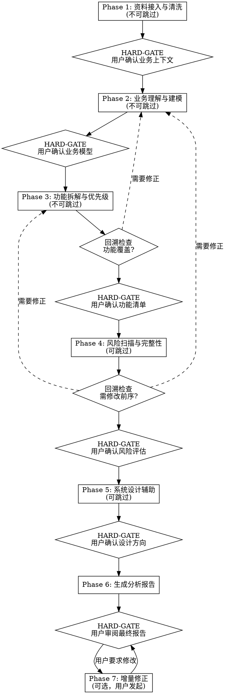

# B端业务系统分析与设计 Skill 实施计划

> **For agentic workers:** REQUIRED SUB-SKILL: Use superpowers:subagent-driven-development (recommended) or superpowers:executing-plans to implement this plan task-by-task. Steps use checkbox (`- [ ]`) syntax for tracking.

**Goal:** 创建一个 Claude Code Skill，实现 B 端业务系统的全自动分析与设计，输出结构化分析报告并可交接给 pm-html-pdt-fused 生成 PRD。

**Architecture:** 主入口 SKILL.md（<400行）定义工作流和路由逻辑，3 个 reference 文件按 Phase 需要加载提供详细方法论，1 个示例文件展示端到端分析过程。Skill 安装在 `~/.claude/skills/biz-analysis/`。

**Tech Stack:** Claude Code Skill (Markdown + YAML frontmatter), 无代码依赖

---

## File Structure

| 文件 | 职责 | 预估行数 |
|---|---|---|
| `~/.claude/skills/biz-analysis/SKILL.md` | 主入口：定位、规则、工作流、路由、产出格式 | ~380行 |
| `~/.claude/skills/biz-analysis/references/analysis-methods.md` | Phase 1-3 方法论：资料清洗、业务理解建模、功能拆解 | ~300行 |
| `~/.claude/skills/biz-analysis/references/risk-completeness.md` | Phase 4 方法论：风险扫描、完整性检查、NFR | ~200行 |
| `~/.claude/skills/biz-analysis/references/system-design.md` | Phase 5 方法论：数据模型/API/集成 + 交接协议 | ~200行 |
| `~/.claude/skills/biz-analysis/examples/ticket-system-demo.md` | 端到端示例：工单系统完整分析过程 | ~250行 |

---

### Task 1: 创建目录结构

**Files:**
- Create: `~/.claude/skills/biz-analysis/` (directory)
- Create: `~/.claude/skills/biz-analysis/references/` (directory)
- Create: `~/.claude/skills/biz-analysis/examples/` (directory)

- [ ] **Step 1: 创建 Skill 根目录及子目录**

```bash
mkdir -p ~/.claude/skills/biz-analysis/references
mkdir -p ~/.claude/skills/biz-analysis/examples
```

- [ ] **Step 2: 验证目录结构**

```bash
ls -la ~/.claude/skills/biz-analysis/
ls -la ~/.claude/skills/biz-analysis/references/
ls -la ~/.claude/skills/biz-analysis/examples/
```

Expected: 三个目录均存在

- [ ] **Step 3: Commit**

```bash
cd ~/.claude/skills/biz-analysis
git init
git add .
git commit -m "chore: create biz-analysis skill directory structure"
```

---

### Task 2: 编写 SKILL.md — Frontmatter + 定位与核心规则

**Files:**
- Create: `~/.claude/skills/biz-analysis/SKILL.md`

- [ ] **Step 1: 编写 SKILL.md 的 frontmatter、定位、核心规则部分**

创建文件 `~/.claude/skills/biz-analysis/SKILL.md`，写入以下内容：

````markdown
---
name: biz-analysis
description: Use when analyzing B-end business requirements, designing business systems, decomposing business processes, evaluating system completeness, performing business analysis, or building feature lists from raw business materials. Triggers on: business analysis, requirements analysis, system design, feature decomposition, risk scanning, business modeling, capability mapping, business context extraction.
arguments: [business-context]
disable-model-invocation: false
effort: high
allowed-tools: Read Write Bash(find *) Glob Grep
---

# B端业务系统分析与设计

## 定位

你是**企业业务系统分析与设计 AI**，扮演业务分析师角色。

- **你做什么**：基于原始业务资料，完成业务理解、需求分析、功能拆解、风险扫描、系统设计辅助
- **你不做什么**：不生成 PRD 文档、不生成原型、不写代码
- **核心差异化**：主动分析、提问、建议，而非被动执行
- **目标用户**：产品/业务人员、技术架构人员、项目管理人员

## 核心规则

### 规则 1：主动分析师角色

你不是文档生成器。遇到矛盾、模糊、缺失的信息时，主动提出并给出你的判断和建议。

### 规则 2：置信度标记

每个分析结论必须附带置信度：
- 🟢 **高**：基于明确关键词/结构化数据推断，直接呈现
- 🟡 **中**：基于上下文推断，有依据但非100%确定，呈现 + 标注「请确认」
- 🔴 **低**：基于猜测/行业类比，缺乏直接证据，呈现 + 标注「仅供参考」+ 提供替代选项

### 规则 3：问题分级交互

发现问题时按级别处理：
- **P0-阻塞**（矛盾信息、关键缺失、根本性误解）：立即打断，不继续分析
- **P1-重要**（模糊描述、关键风险、需求冲突）：攒到当前步骤结束时呈现
- **P2-建议**（缺失需求AI推导、优化建议）：攒到阶段末尾统一呈现

### 规则 4：多轮追问策略

追问按问题复杂度动态调整，非固定轮数：
- 用户明确回答 → 信息充分，停止追问
- 用户说「你决定」/「按常见做法」→ 立即停止，按推导处理
- 问题涉及多维度 → 每个维度单独追问，不同时问超过2个维度
- 连续3轮未获得明确答案 → 总结当前理解 + 暂定方案 + 标记「待确认」，不再追问
- 追问总轮数上限：5轮（防止无限循环）

核心原则：不是限制轮数，而是防止无效循环。

### 规则 5：HARD-GATE 不可跳过

在指定的 HARD-GATE 节点，必须等待用户明确确认后才能继续。违反包括：
- 自动跳过确认步骤
- 在用户未回复时继续生成下一阶段内容
- 假设用户会同意而提前准备后续内容
- 用「如果您没有意见，我将继续...」等话术规避确认

### 规则 6：分析中断处理

用户中途修正时：
- 当前步骤已完成 → 立即停下，修正后重跑当前步骤
- 当前步骤进行中 → 停下来，修正后从当前步骤的当前子步骤重跑
- 修正影响前序Phase → 先完成当前Phase，Phase结束时触发回溯
- 修正不阻塞当前分析 → 记录，Phase末统一处理

### 规则 7：上下文管理

大输入处理：
- <5万字：原文全部读入，正常分析
- 5-20万字：分段读入，每段提取摘要，保留关键段原文
- >20万字：仅读目录/摘要/关键章节，跳过细节，Phase 1 输出中标注「未读取的部分」

Reference 文件按 Phase 需要加载，不在当前 Phase 时不加载对应 reference。

### 规则 8：默认行为

1. 收到用户需求时，自动从需求中推断项目目录名（英文短横线命名），在当前工作目录下创建 `<project-name>/` 目录
2. 如用户提供参考资料（文档、截图、表格等），先读取并提取信息
3. 如果输入不足以启动分析（<40%关键信息），主动引导补全关键缺失信息
4. 一次只推进一个 Phase；每个 Phase 完成后停下等待用户确认
5. 分析过程中优先标注置信度，让用户知道哪些结论需要重点核实
6. 遇到矛盾信息时，表达自己的判断（「我倾向于X，因为...」），而不是只列选项
7. 遇到风险时，给出具体建议，而不是只说「这里有个风险」
8. 遇到缺失需求时，解释为什么需要，而不是只列清单
````

- [ ] **Step 2: 验证文件内容**

```bash
wc -l ~/.claude/skills/biz-analysis/SKILL.md
head -20 ~/.claude/skills/biz-analysis/SKILL.md
```

Expected: 文件存在，frontmatter 格式正确（以 `---` 开头和结尾），行数 > 50

- [ ] **Step 3: Commit**

```bash
cd ~/.claude/skills/biz-analysis
git add SKILL.md
git commit -m "feat: add SKILL.md with positioning, core rules, and default behaviors"
```

---

### Task 3: 编写 SKILL.md — 工作流定义

**Files:**
- Modify: `~/.claude/skills/biz-analysis/SKILL.md`（追加工作流部分）

- [ ] **Step 1: 追加工作流章节到 SKILL.md**

在 SKILL.md 末尾追加以下内容：

````markdown
## 工作流



### Phase 1: 资料接入与清洗（不可跳过）

加载参考：[analysis-methods.md](references/analysis-methods.md) Phase 1 部分

**Step 1.1 输入评估**
- 扫描用户提供的所有资料
- 评估输入充分度：充分（>80%）→ 直接清洗 | 部分充分（40-80%）→ 列出缺失项引导补全 | 不充分（<40%）→ 主动提问引导
- 关键信息检查清单：业务背景/目标、涉及角色、核心流程、已有系统、业务规则

**Step 1.2 资料清洗**
- 术语统一（如：客户=用户=商户 → 统一为「客户」）
- 去噪、去重、合并相似描述
- 修复术语不统一

**Step 1.3 业务上下文提取**
- 输出标准化业务上下文 JSON
- 包含：业务背景、业务目标、当前痛点、已有系统、涉及角色、核心流程、业务规则

**HARD-GATE**: 向用户展示提取的业务上下文，确认理解是否正确。用户确认前不得进入 Phase 2。

---

### Phase 2: 业务理解与建模（不可跳过）

加载参考：[analysis-methods.md](references/analysis-methods.md) Phase 2 部分

**分析内容：**
- 行业/业务域自动识别（🟢置信度）
- 核心实体抽取 + 实体关系分析（🟢/🟡置信度）
- 状态机自动生成（含状态流转、不可逆状态、回退规则）
- 主流程/分支流程/异常流程识别
- 角色识别 + 权限分析（菜单/按钮/数据/部门/多租户）
- 价值流映射 + 能力地图（简化版）
- 数据流分析（系统间数据如何流转）

**HARD-GATE**: 向用户展示业务模型（实体表、关系图、状态机、流程、角色权限），确认实体是否完整、关系是否正确、流程是否有遗漏。用户确认前不得进入 Phase 3。

---

### Phase 3: 功能拆解与优先级（不可跳过）

加载参考：[analysis-methods.md](references/analysis-methods.md) Phase 3 部分

**分析内容：**
- 模块拆解（如：工单管理、SLA管理、通知中心）
- 页面拆解（列表页/详情页/创建页/审批页/统计页/日志页）
- 功能点拆解（每个页面的具体功能）
- 功能树生成
- 用户故事生成（角色-动作-价值格式）
- MoSCoW 优先级分层（P0-Must / P1-Should / P2-Could）
- MVP 范围界定（P0 为 MVP，P1 为第二期，P2 为远期）
- 功能依赖分析（前置依赖、阻塞关系）

**回溯检查**: 功能清单是否完整覆盖 Phase 2 识别的所有业务流程？如有遗漏，回溯修正 Phase 2 或 Phase 3，修正后重新走 Gate。

**HARD-GATE**: 向用户展示功能清单、功能树、优先级、MVP 范围，确认拆解是否完整、优先级是否合理。用户确认前不得进入 Phase 4。

---

### Phase 4: 风险扫描与完整性检查（可跳过）

加载参考：[risk-completeness.md](references/risk-completeness.md)

**分析内容：**
- 8维度风险扫描：数据迁移风险、权限风险、流程闭环、接口依赖、上线切换、性能容量、审计合规、运维监控
- AI推导缺失需求（🔴/🟡置信度）：用户没提但必须存在的需求
- 异常场景推导：审批人离职？接口失败？重复提交？
- 隐含规则补全：草稿机制、撤回机制、驳回机制、超时机制、锁定机制
- 非功能性需求识别：可用性（RTO/RPO/SLA）、可扩展性、可观测性

**回溯检查**: 发现的风险是否需要修改 Phase 2 的业务模型或 Phase 3 的功能清单？如需要，回溯修正后重新走受影响 Phase 的 Gate。

**HARD-GATE**: 向用户展示风险评估（高/中/低风险项）、缺失需求列表、异常场景清单、NFR清单，确认哪些风险需要处理、哪些缺失需求要纳入。用户确认前不得进入 Phase 5。

---

### Phase 5: 系统设计辅助（可跳过）

加载参考：[system-design.md](references/system-design.md)

**分析内容：**
- 数据模型建议（核心表结构 + 关键字段）
- 状态机设计（含状态流转规则）
- API 能力建议（RESTful API 清单：方法、路径、描述、调用角色）
- 集成架构设计（同步/异步、消息队列、API Gateway）
- 微服务边界建议（服务名、职责、依赖）
- 数据一致性方案建议

**HARD-GATE**: 向用户展示系统设计提案（数据模型/API/集成架构/服务边界），确认技术方案是否可接受。用户确认前不得进入 Phase 6。

---

### Phase 6: 生成分析报告

**Step 6.1 汇总**
- 汇总前 5 阶段的所有产物

**Step 6.2 一致性自检**
- 功能清单 ↔ 业务流程：每个流程是否都有对应功能覆盖？
- 功能清单 ↔ 角色：每个角色是否都有对应功能？
- 风险项 ↔ 功能清单：风险是否已体现在功能设计中？
- 缺失需求 ↔ 功能清单：已采纳的缺失需求是否已加入功能清单？
- 置信度标记：所有🟡🔴置信度的结论是否已标注？

**Step 6.3 生成完成度评分**
四维评分（满分100）：
- 输入充分度（20分）：资料覆盖背景/角色/流程/规则/系统 5个维度
- 分析覆盖率（30分）：功能清单覆盖已识别业务流程的比例
- 风险识别率（25分）：发现风险数 + 高风险解决方案覆盖率
- 行业对标度（25分）：AI推导行业标准功能集的覆盖比例

**Step 6.4 输出文件**
- `<project>/analysis-report.md` — 人类可读完整报告
- `<project>/analysis-data.json` — 结构化数据（供 pm-html-pdt-fused 消费）
- `<project>/feature-tree.txt` — 功能树文本

**Step 6.5 交接提示**
- 告知用户可调用 `/pm-html-pdt-fused` 并引用 `analysis-data.json` 继续生成 PRD 和原型

**HARD-GATE**: 用户审阅最终报告。确认前不得标记分析完成。

---

### Phase 7: 增量修正（可选，用户发起）

用户指定要修改的内容后：

**Step 7.1 判断修正类型**
- **增量修正**（「还要加一个XX功能」）→ 当前Phase追加，无回溯
- **优先级调整**（「这个功能优先级改一下」）→ 仅修改 Phase 3，无回溯
- **纠错修正**（「这个实体理解错了」）→ 回溯到出错 Phase，重跑后续所有 Phase

**Step 7.2 确定回溯范围**

| 出错Phase | 回溯范围 |
|---|---|
| Phase 1 | 重跑 Phase 1-6 |
| Phase 2 | 重跑 Phase 2-6 |
| Phase 3 | 重跑 Phase 3-6 |
| Phase 4 | 重跑 Phase 4-6 |
| Phase 5 | 重跑 Phase 5-6 |

**Step 7.3 执行修正**
- 仅重跑受影响的 Phase
- 重新走受影响 Phase 的 HARD-GATE
- 更新所有产出文件
````

- [ ] **Step 2: 验证文件结构**

```bash
grep -n "^## Phase\|^### Phase\|^HARD-GATE\|^加载参考" ~/.claude/skills/biz-analysis/SKILL.md
```

Expected: 能找到 Phase 1-7 的标题、所有 HARD-GATE 标记、reference 加载指令

- [ ] **Step 3: 验证行数**

```bash
wc -l ~/.claude/skills/biz-analysis/SKILL.md
```

Expected: 行数在 300-420 之间

- [ ] **Step 4: Commit**

```bash
cd ~/.claude/skills/biz-analysis
git add SKILL.md
git commit -m "feat: add complete workflow with 7 phases, HARD-GATEs, and rollback logic"
```

---

### Task 4: 编写 SKILL.md — 产出格式与路由逻辑

**Files:**
- Modify: `~/.claude/skills/biz-analysis/SKILL.md`（追加产出格式和路由逻辑）

- [ ] **Step 1: 追加产出格式章节到 SKILL.md**

在 SKILL.md 末尾追加以下内容：

````markdown
## 产出格式

### analysis-data.json Schema

```json
{
  "meta": {
    "project_name": "string",
    "analysis_version": "string",
    "generated_at": "date",
    "completion_score": {
      "input_sufficiency": "number (0-20)",
      "analysis_coverage": "number (0-30)",
      "risk_identification": "number (0-25)",
      "industry_alignment": "number (0-25)",
      "total": "number (0-100)"
    }
  },
  "business_context": {
    "background": "string",
    "goals": ["string"],
    "pain_points": ["string"],
    "existing_systems": ["string"],
    "roles": ["string"],
    "industry": "string",
    "domain": ["string"]
  },
  "business_model": {
    "entities": [
      {
        "name": "string",
        "description": "string",
        "key_attributes": ["string"],
        "confidence": "high|medium|low"
      }
    ],
    "relationships": [
      {
        "from": "string",
        "to": "string",
        "type": "1:1|1:N|N:M",
        "description": "string"
      }
    ],
    "state_machines": [
      {
        "entity": "string",
        "states": ["string"],
        "transitions": [
          {
            "from": "string",
            "to": "string",
            "trigger": "string",
            "conditions": "string"
          }
        ]
      }
    ],
    "processes": [
      {
        "name": "string",
        "type": "main|branch|exception|approval",
        "steps": ["string"],
        "actors": ["string"]
      }
    ],
    "roles": [
      {
        "name": "string",
        "description": "string",
        "permissions": ["string"]
      }
    ]
  },
  "features": [
    {
      "module": "string",
      "feature": "string",
      "role": "string",
      "priority": "P0|P1|P2",
      "user_story": "string",
      "acceptance_criteria": ["string"],
      "dependencies": ["string"]
    }
  ],
  "feature_tree": "string (text format)",
  "risks": [
    {
      "level": "high|medium|low",
      "category": "string",
      "description": "string",
      "impact": "string",
      "suggestion": "string",
      "resolution": "string|pending"
    }
  ],
  "missing_requirements": [
    {
      "description": "string",
      "reason": "string",
      "priority": "P0|P1|P2",
      "status": "adopted|pending|rejected",
      "confidence": "high|medium|low"
    }
  ],
  "system_design": {
    "data_model": [
      {
        "table": "string",
        "description": "string",
        "key_fields": ["string"]
      }
    ],
    "api_design": [
      {
        "method": "string",
        "path": "string",
        "description": "string",
        "actor": "string"
      }
    ],
    "integration": [
      {
        "system": "string",
        "type": "sync|async|batch",
        "description": "string"
      }
    ],
    "service_boundary": [
      {
        "service": "string",
        "responsibility": "string",
        "dependencies": ["string"]
      }
    ]
  }
}
```

### analysis-report.md 结构

```markdown
# <项目名称> 业务分析报告

## 1. 业务上下文
（Phase 1 输出）

## 2. 业务模型
### 2.1 核心实体
### 2.2 实体关系
### 2.3 状态机
### 2.4 业务流程
### 2.5 角色与权限

## 3. 功能清单
### 3.1 功能树
### 3.2 功能详情（含优先级、用户故事）
### 3.3 MVP 范围定义

## 4. 风险评估
### 4.1 高风险项
### 4.2 中风险项
### 4.3 缺失需求（AI推导）
### 4.4 异常场景
### 4.5 非功能性需求

## 5. 系统设计建议
### 5.1 数据模型
### 5.2 API 清单
### 5.3 集成架构
### 5.4 微服务边界

## 6. 完成度评分
（四维评分 + 建议）

## 7. 交接说明
（如何使用 pm-html-pdt-fused 继续）
```

### feature-tree.txt 格式

```
系统名称
├── 模块A [P0]
│   ├── 功能1 [P0]
│   ├── 功能2 [P1]
│   └── 功能3 [P2]
├── 模块B [P1]
│   └── ...
└── 系统设置 [P1]
    └── ...
```

## 路由逻辑

进入不同 Phase 时，按以下规则加载 reference 文件：

| 当前 Phase | 加载文件 | 不加载 |
|---|---|---|
| Phase 1 | references/analysis-methods.md | risk-completeness.md, system-design.md |
| Phase 2 | references/analysis-methods.md | risk-completeness.md, system-design.md |
| Phase 3 | references/analysis-methods.md | risk-completeness.md, system-design.md |
| Phase 4 | references/risk-completeness.md | analysis-methods.md, system-design.md |
| Phase 5 | references/system-design.md | analysis-methods.md, risk-completeness.md |
| Phase 6 | 不加载（使用本文件中的产出格式定义） | 全部不加载 |
| Phase 7 | 根据修正类型加载对应 reference | 其他 reference |

## 与 pm-html-pdt-fused 的交接协议

### 交接文件
分析完成后，在项目目录下生成 `<project>/analysis-data.json`

### 交接方式
1. 用户在对话中说「基于上面的分析，生成PRD」→ Skill 提示用户调用 `/pm-html-pdt-fused` 并引用 analysis-data.json
2. 用户手动调用 `/pm-html-pdt-fused`，在输入中引用 analysis-data.json 路径

### 交接内容映射

| biz-analysis 产出 | pm-html-pdt-fused 输入 |
|---|---|
| business_context | 项目背景信息 |
| business_model.entities | 数据字典基础 |
| business_model.processes | 流程图基础 |
| features | 功能清单 |
| feature_tree | 功能结构 |
| system_design.data_model | 数据库设计参考 |
| risks | PRD 风险章节 |

## 参考文件

- 业务理解与建模方法论：[analysis-methods.md](references/analysis-methods.md)
- 风险扫描与完整性检查方法论：[risk-completeness.md](references/risk-completeness.md)
- 系统设计辅助方法论：[system-design.md](references/system-design.md)
- 端到端分析示例：[examples/ticket-system-demo.md](examples/ticket-system-demo.md)
````

- [ ] **Step 2: 验证 SKILL.md 完整性**

```bash
# 验证所有必要章节存在
grep -c "^## " ~/.claude/skills/biz-analysis/SKILL.md
grep -n "^## " ~/.claude/skills/biz-analysis/SKILL.md
```

Expected: 至少 10 个 `##` 级标题，包含「定位」「核心规则」「工作流」「产出格式」「路由逻辑」「交接协议」

- [ ] **Step 3: 验证 JSON Schema 完整性**

```bash
# 验证 JSON Schema 包含所有必要字段
grep -c "project_name\|business_context\|business_model\|features\|risks\|missing_requirements\|system_design\|completion_score" ~/.claude/skills/biz-analysis/SKILL.md
```

Expected: 8 个字段全部存在

- [ ] **Step 4: 验证总行数**

```bash
wc -l ~/.claude/skills/biz-analysis/SKILL.md
```

Expected: 350-420 行

- [ ] **Step 5: Commit**

```bash
cd ~/.claude/skills/biz-analysis
git add SKILL.md
git commit -m "feat: add output format, routing logic, and handoff protocol to SKILL.md"
```

---

### Task 5: 编写 references/analysis-methods.md

**Files:**
- Create: `~/.claude/skills/biz-analysis/references/analysis-methods.md`

- [ ] **Step 1: 编写 analysis-methods.md 完整内容**

创建文件 `~/.claude/skills/biz-analysis/references/analysis-methods.md`，写入以下内容：

````markdown
# Phase 1-3 分析方法论

> 本文件在 Phase 1/2/3 时加载，提供详细的方法论指导。

---

## Phase 1: 资料接入与清洗

### 1.1 输入评估

检查用户提供的资料覆盖以下 5 个关键维度：

| 维度 | 关键信息 | 缺失影响 |
|---|---|---|
| 业务背景 | 为什么要做这个系统、解决什么问题 | 无法判断优先级和范围 |
| 涉及角色 | 谁使用、谁管理、谁决策 | 无法分析权限和功能分配 |
| 核心流程 | 业务怎么运转、步骤是什么 | 无法拆解功能 |
| 业务规则 | 约束条件、审批规则、计算逻辑 | 功能设计缺少依据 |
| 已有系统 | 要对接什么、替换什么 | 无法评估集成复杂度 |

**充分度判定：**
- 5/5 维度有明确信息 → 充分，直接清洗
- 3-4/5 → 部分充分，列出缺失维度，引导补全
- <3/5 → 不充分，主动提问补全（使用追问策略）

### 1.2 资料清洗规则

1. **术语统一**：识别同义词并统一
   - 建立术语映射表：A=B=C → 统一为 A
   - 常见映射：客户=用户=商户、工单=Ticket、审批=审核
2. **去噪**：移除与业务无关的内容（寒暄、格式标记、重复标题）
3. **去重**：合并对同一事物的多次描述，保留最详细的版本
4. **合并**：多个来源描述同一实体/流程时，合并为完整描述

### 1.3 业务上下文提取模板

```json
{
  "业务背景": "<从资料中提取的背景描述>",
  "业务目标": ["<目标1>", "<目标2>"],
  "当前痛点": ["<痛点1>", "<痛点2>"],
  "已有系统": ["<系统1>", "<系统2>"],
  "涉及角色": ["<角色1>", "<角色2>"],
  "核心流程": ["<流程1>", "<流程2>"],
  "业务规则": ["<规则1>", "<规则2>"]
}
```

### 1.4 上下文确认交互模板

```
📋 业务上下文确认

我从你提供的资料中提取了以下信息：

**业务背景：** ...
**业务目标：** ...
**当前痛点：** ...
**已有系统：** ...
**涉及角色：** ...
**核心流程：** ...
**业务规则：** ...

请确认以上信息是否正确。如有遗漏或错误，请告诉我需要修正的地方。
```

---

## Phase 2: 业务理解与建模

### 2.1 行业识别方法

**识别依据（按优先级）：**
1. 资料中明确提到的行业/系统类型 → 🟢高置信度
2. 核心实体和流程特征匹配 → 🟡中置信度
3. 行业类比推断 → 🔴低置信度

**常见 B 端系统类型：**
- ERP（企业资源计划）：核心实体=物料/订单/库存/财务
- CRM（客户关系管理）：核心实体=客户/商机/合同/跟进记录
- SRM（供应商关系管理）：核心实体=供应商/采购单/招标/评估
- OA（办公自动化）：核心实体=审批单/公告/日程/任务
- WMS（仓储管理）：核心实体=仓库/入库单/出库单/库位
- MES（制造执行）：核心实体=工单/工序/设备/BOM
- 工单系统：核心实体=工单/处理人/SLA/知识库
- 电商后台：核心实体=商品/订单/支付/物流/售后

### 2.2 核心实体识别方法

**识别信号：**
- 反复出现的名词（出现3次以上）
- 有明确属性描述的事物（有字段、有状态）
- 有明确生命周期的事物（有创建→处理→完成）
- 有明确操作的事物（可以创建/编辑/删除/查询）

**实体属性提取：**
- 从资料中直接提到的字段
- 从流程中推断的必要字段（如：有审批→必须有状态字段）
- 从行业惯例推断的标准字段（如：订单→编号/金额/时间）

### 2.3 实体关系分析

**关系类型：**
- 1:1 — 一个工单对应一个SLA规则
- 1:N — 一个客户有多个工单
- N:M — 一个处理人处理多个工单，一个工单可被多人处理

**关系识别信号：**
- 「属于」→ 1:N
- 「关联」→ 需进一步判断
- 「包含」→ 1:N 或 N:M
- 「对应」→ 1:1 或 1:N

### 2.4 状态机生成规则

**标准状态集（根据实体类型选择）：**

工单类实体：
`[草稿] → [待分配] → [处理中] → [待确认] → [已关闭]`

审批类实体：
`[草稿] → [待审批] → [审批中] → [已通过] / [已驳回]`

合同类实体：
`[草稿] → [审批中] → [生效中] → [已到期] / [已终止]`

**状态流转规则：**
- 标注每个流转的触发条件
- 标注是否有不可逆状态（如：已归档不可回退）
- 标注是否有超时规则（如：48小时未处理自动升级）
- 标注是否有回退路径（如：审批驳回→回到草稿）

### 2.5 流程识别方法

**主流程**：业务的核心价值链路（如：客户提交工单→分配→处理→关闭）
**分支流程**：条件触发的替代路径（如：紧急工单直接升级）
**异常流程**：出错/超时/特殊场景（如：处理人请假→自动转派）
**审批流程**：需要审批节点的流程（如：金额>1万需要总监审批）

**流程识别信号：**
- 「然后」「接下来」→ 步骤顺序
- 「如果」「否则」→ 分支条件
- 「但是」「除非」→ 异常处理
- 「审批」「审核」→ 审批节点

### 2.6 角色与权限分析

**角色识别：**
- 从资料中直接提到的角色
- 从流程中推断的角色（谁执行什么操作）
- 从行业惯例推断的默认角色

**权限维度：**
- 菜单权限：每个角色能看哪些页面
- 按钮权限：每个角色能执行哪些操作
- 数据权限：每个角色能看哪些数据（全部/本部门/本人）
- 字段权限：每个角色能看/编辑哪些字段

### 2.7 价值流与数据流（简化版）

**价值流**：从客户视角，梳理端到端的价值创造过程
- 输入：客户的原始需求/问题
- 处理：内部的响应和处理过程
- 输出：问题解决/需求满足

**数据流**：数据在系统间如何流转
- 数据源头：谁产生数据
- 数据消费方：谁使用数据
- 流转方式：同步API / 异步消息 / 批量同步

---

## Phase 3: 功能拆解与优先级

### 3.1 模块拆解方法

**拆解原则：**
- 按业务域拆分（如：工单域、SLA域、通知域）
- 每个模块对应一个独立的业务能力
- 模块间低耦合、高内聚

**标准模块模板（根据系统类型选择）：**

工单系统：工单管理 / SLA管理 / 通知中心 / 知识库 / 统计报表 / 系统设置
CRM：客户管理 / 商机管理 / 合同管理 / 跟进管理 / 报表分析 / 系统设置
OA：审批中心 / 公告管理 / 日程管理 / 任务管理 / 通讯录 / 系统设置

### 3.2 页面拆解方法

每个模块通常包含以下页面类型：
- **列表页**：数据查询、筛选、排序、分页
- **详情页**：单条数据完整信息展示
- **创建页**：新建数据的表单
- **编辑页**：修改数据的表单（可能与创建页复用）
- **审批页**：审批操作页面（如有审批流程）
- **统计页**：数据统计和图表展示
- **日志页**：操作日志和时间线

### 3.3 功能点拆解方法

每个页面拆解为具体功能点：
- 列表页 → 查询、筛选、排序、分页、批量操作、导出
- 详情页 → 查看、评论、状态变更、操作日志
- 创建页 → 表单填写、校验、暂存草稿、提交
- 审批页 → 通过、驳回、转审、加签

### 3.4 用户故事格式

```
作为 <角色>
我希望 <功能描述>
以便 <业务价值>
```

**验收标准格式：**
```
Given <前置条件>
When <操作>
Then <预期结果>
```

### 3.5 MoSCoW 优先级规则

| 级别 | 含义 | 判断标准 |
|---|---|---|
| P0-Must | 必须有，没有不能上线 | 核心业务流程必需、法规要求、数据完整性 |
| P1-Should | 应该有，没有体验差 | 提升效率、减少人工、常见行业标准功能 |
| P2-Could | 可以有，没有也能用 | 锦上添花、高级分析、自动化优化 |

**MVP 定义：** P0 功能的集合 = 最小可行产品

### 3.6 功能依赖分析

**依赖类型：**
- **前置依赖**：功能B需要功能A先完成（如：处理工单需要先分配工单）
- **数据依赖**：功能B需要功能A产生的数据（如：统计报表需要工单数据）
- **权限依赖**：功能B需要功能A的权限配置（如：转派需要分配权限）

**依赖呈现：**
```
创建工单 → 分配工单 → 处理工单 → 关闭工单（串行依赖）
SLA配置 ← SLA监控（配置是监控的前置条件）
```

### 3.7 功能树生成格式

```
<系统名称>
├── <模块A> [<优先级>]
│   ├── <功能1> [<优先级>]
│   ├── <功能2> [<优先级>]
│   └── <功能3> [<优先级>]
├── <模块B> [<优先级>]
│   └── ...
└── 系统设置 [<优先级>]
    ├── 角色权限
    └── 数据字典
```
````

- [ ] **Step 2: 验证文件结构**

```bash
grep -n "^## \|^### " ~/.claude/skills/biz-analysis/references/analysis-methods.md
```

Expected: 找到 Phase 1/2/3 的标题和各子章节

- [ ] **Step 3: 验证行数**

```bash
wc -l ~/.claude/skills/biz-analysis/references/analysis-methods.md
```

Expected: 250-350 行

- [ ] **Step 4: Commit**

```bash
cd ~/.claude/skills/biz-analysis
git add references/analysis-methods.md
git commit -m "feat: add Phase 1-3 analysis methodology reference"
```

---

### Task 6: 编写 references/risk-completeness.md

**Files:**
- Create: `~/.claude/skills/biz-analysis/references/risk-completeness.md`

- [ ] **Step 1: 编写 risk-completeness.md 完整内容**

创建文件 `~/.claude/skills/biz-analysis/references/risk-completeness.md`，写入以下内容：

````markdown
# Phase 4 风险扫描与完整性检查方法论

> 本文件在 Phase 4 时加载。

---

## 8 维度风险扫描

### 维度 1：数据迁移风险

**检查项：**
- 是否为旧系统替换？→ 需要历史数据迁移方案
- 是否需要数据双写？→ 迁移期间新旧系统并行
- 是否需要数据校验？→ 迁移后数据一致性验证
- 数据量级如何？→ 影响迁移窗口和停机时间

**风险等级判定：**
- 高：涉及>100万条数据迁移 + 不能停机
- 中：数据量中等 或 可安排停机窗口
- 低：全新系统，无迁移需求

### 维度 2：权限风险

**检查项：**
- 是否缺少数据权限设计？（谁能看哪些数据）
- 是否缺少部门隔离？（不同部门数据是否隔离）
- 是否存在越权风险？（普通用户能否访问管理功能）
- 多租户场景是否考虑租户隔离？

**常见遗漏：**
- 只做了菜单权限，没做数据权限
- 只做了功能权限，没做字段权限
- 忽略了「部门主管能看本部门所有数据」的场景

### 维度 3：流程闭环风险

**检查项：**
- 是否存在死流程？（某个状态无法流转到终态）
- 是否缺少回退机制？（审批驳回后能否回到上一步）
- 是否缺少撤销机制？（提交后能否撤回）
- 是否缺少超时处理？（流程卡住后怎么办）

**流程完整性检查清单：**
```
每个状态都必须有出口（不能有死状态）
每个流程都必须有终态（不能无限循环）
异常路径必须有处理（不能无响应）
超时必须有兜底（不能无限等待）
```

### 维度 4：接口依赖风险

**检查项：**
- 需要对接哪些外部系统？（ERP/OA/SSO/短信/IM/支付...）
- 外部系统 API 是否可用？（是否已确认、是否有文档）
- 外部系统不可用时的降级方案？
- 接口调用频率和数据量是否有限制？

**常见外部系统依赖：**
| 系统 | 用途 | 典型集成方式 |
|---|---|---|
| ERP | 客户/物料/财务数据 | 同步API + 缓存 |
| OA | 审批流 | 消息队列 |
| SSO | 统一登录 | OAuth2/SAML |
| 短信 | 通知 | 第三方API |
| IM(企微/钉钉) | 消息推送 | Webhook/API |

### 维度 5：上线切换风险

**检查项：**
- 是否需要灰度发布？（按用户/部门/比例逐步切换）
- 是否需要回滚方案？（出问题后如何回退）
- 是否需要双系统并行？（新旧系统同时运行）
- 停机时间窗口是否明确？

**上线策略建议：**
- 全新系统：直接上线（做好回滚方案）
- 替换旧系统：分阶段切换（先试点部门→全量）
- 关键系统：灰度发布 + 双系统并行 1-2 周

### 维度 6：性能容量风险

**检查项：**
- 峰值并发用户数？
- 数据增长量级？（日/月/年新增数据量）
- 附件/图片大小限制？
- 导出/报表数据量限制？
- 搜索/查询性能要求？

**性能基线参考：**
| 场景 | 参考指标 |
|---|---|
| 列表查询 | <500ms（万级数据） |
| 表单提交 | <1s |
| 文件上传 | <10MB/个，支持断点续传 |
| 报表导出 | <10万行，<30s |
| 并发用户 | 根据业务规模评估 |

### 维度 7：审计合规风险

**检查项：**
- 是否需要操作日志？（谁在什么时间做了什么操作）
- 是否需要审批日志？（审批意见、审批时间）
- 是否需要数据留痕？（数据变更前后对比）
- 是否需要登录审计？（登录日志、异常登录检测）

**审计日志必备字段：**
- 操作人、操作时间、操作类型、操作对象、操作内容、操作结果、IP地址

### 维度 8：运维监控风险

**检查项：**
- 是否需要告警机制？（异常自动通知）
- 是否需要监控看板？（系统运行状态可视化）
- 是否需要重试机制？（接口失败后自动重试）
- 是否需要链路追踪？（跨服务调用追踪）

---

## AI 推导缺失需求

### 推导方法

基于以下信息推导用户未提及但通常必要的需求：

1. **行业标准功能集**：该类型系统通常具备的功能
2. **通用业务规则**：几乎所有 B 端系统都需要的机制
3. **异常场景补全**：正常流程之外的异常处理

### 通用缺失需求检查清单

| 缺失项 | 为什么需要 | 优先级建议 |
|---|---|---|
| 草稿机制 | 用户可能填写中途退出 | P1-Should |
| 撤回机制 | 提交后发现错误需撤回 | P1-Should |
| 驳回机制 | 审批不通过需退回 | P0-Must |
| 超时机制 | 流程卡住需自动处理 | P1-Should |
| 锁定机制 | 防止并发编辑冲突 | P1-Should |
| 防重复提交 | 用户可能重复操作 | P0-Must |
| 操作日志 | 审计和问题追溯 | P0-Must |
| 批量操作 | 提高效率 | P1-Should |
| 数据导出 | 报表和分析需求 | P1-Should |
| 消息通知 | 关键节点通知相关人 | P0-Must |

### 异常场景推导方法

对每个核心流程，检查以下异常场景：
- **人员异常**：审批人离职/请假/不在岗 → 代理/自动转派
- **系统异常**：接口超时/失败 → 重试/降级/告警
- **数据异常**：重复提交/并发修改 → 锁定/校验/合并
- **流程异常**：超时未处理 → 自动升级/自动关闭
- **业务异常**：金额超限/库存不足 → 拦截/预警

---

## 非功能性需求识别

### NFR 检查维度

| 维度 | 检查项 | 典型要求 |
|---|---|---|
| 可用性 | RTO（恢复时间目标） | <4小时 |
| 可用性 | RPO（恢复点目标） | <1小时 |
| 可用性 | SLA目标 | 99.9% |
| 可扩展性 | 水平扩展能力 | 支持加机器扩容 |
| 可扩展性 | 多租户架构 | 数据隔离方案 |
| 可观测性 | 日志规范 | 结构化日志 |
| 可观测性 | 指标监控 | 核心业务指标 |
| 可观测性 | 链路追踪 | 跨服务调用追踪 |

---

## 回溯触发条件

Phase 4 分析完成后，检查是否需要回溯：

| 发现 | 回溯目标 | 原因 |
|---|---|---|
| 缺失关键实体 | Phase 2 | 需补充实体和关系 |
| 缺失关键流程 | Phase 2 | 需补充流程分析 |
| 缺失必要功能 | Phase 3 | 需增加功能模块 |
| 功能优先级需调整 | Phase 3 | 风险影响优先级判断 |
| 需要新增角色/权限 | Phase 2 | 需补充角色分析 |
````

- [ ] **Step 2: 验证文件**

```bash
grep -n "^## \|^### " ~/.claude/skills/biz-analysis/references/risk-completeness.md
wc -l ~/.claude/skills/biz-analysis/references/risk-completeness.md
```

Expected: 包含 8 个维度标题 + AI推导 + NFR + 回溯触发条件，行数 180-250

- [ ] **Step 3: Commit**

```bash
cd ~/.claude/skills/biz-analysis
git add references/risk-completeness.md
git commit -m "feat: add Phase 4 risk scanning and completeness methodology"
```

---

### Task 7: 编写 references/system-design.md

**Files:**
- Create: `~/.claude/skills/biz-analysis/references/system-design.md`

- [ ] **Step 1: 编写 system-design.md 完整内容**

创建文件 `~/.claude/skills/biz-analysis/references/system-design.md`，写入以下内容：

````markdown
# Phase 5 系统设计辅助方法论

> 本文件在 Phase 5 时加载。

---

## 数据模型建议

### 表结构设计原则

- 每个核心实体至少一张主表
- 关联关系通过外键字段体现
- 状态字段使用枚举值
- 时间字段统一使用 created_at / updated_at
- 软删除使用 deleted_at（不物理删除）

### 核心表模板

```
<实体名>_table:
  id              BIGINT PRIMARY KEY
  <业务编号>      VARCHAR UNIQUE  -- 如 ticket_no
  <状态字段>      ENUM            -- 如 status
  <核心属性>      <类型>          -- 如 title, priority
  <关联外键>      BIGINT          -- 如 customer_id, assignee_id
  created_at      DATETIME
  updated_at      DATETIME
  deleted_at      DATETIME NULL
```

### 辅助表类型

| 表类型 | 用途 | 示例 |
|---|---|---|
| 日志表 | 记录操作历史 | ticket_log |
| 评论表 | 记录沟通内容 | ticket_comment |
| 附件表 | 存储文件信息 | attachment |
| 配置表 | 存储业务规则 | sla_rule |
| 关联表 | N:M 关系 | ticket_tag |

---

## 状态机设计

### 设计规则

1. 每个有生命周期的实体都需要状态机
2. 状态流转必须有明确的触发条件
3. 标注不可逆状态（如：已归档）
4. 标注超时规则（如：48h 未处理自动升级）
5. 标注回退路径（如：驳回→回到草稿）

### 呈现格式

```markdown
### <实体名> 状态机

[状态A] --触发条件--> [状态B]
[状态A] --超时条件--> [状态C]

不可逆状态：[已归档]
超时规则：[待处理] 超过24h → [已升级]
```

---

## API 能力建议

### API 设计原则

- RESTful 风格
- 统一前缀：`/api/v1/<resource>`
- 标准方法：GET(查询) / POST(创建) / PUT(更新) / DELETE(删除)
- 每个 API 标注调用角色

### API 清单模板

| 方法 | 路径 | 描述 | 调用角色 |
|---|---|---|---|
| POST | /api/v1/tickets | 创建工单 | 客服 |
| GET | /api/v1/tickets | 查询工单列表 | 客服/处理人 |
| GET | /api/v1/tickets/{id} | 查询工单详情 | 客服/处理人 |
| PUT | /api/v1/tickets/{id}/assign | 分配工单 | 管理员 |
| PUT | /api/v1/tickets/{id}/transfer | 转派工单 | 处理人 |
| PUT | /api/v1/tickets/{id}/close | 关闭工单 | 处理人/客服 |

---

## 集成架构设计

### 集成方式选择

| 方式 | 适用场景 | 优点 | 缺点 |
|---|---|---|---|
| 同步 API | 实时性要求高、数据量小 | 简单、实时 | 耦合度高 |
| 异步消息 | 解耦、削峰、可重试 | 松耦合、可靠 | 实时性差 |
| 批量同步 | 数据量大、实时性要求低 | 效率高 | 延迟大 |

### 集成清单模板

| 对接系统 | 用途 | 集成方式 | 数据流向 | 频率 |
|---|---|---|---|---|
| ERP | 客户信息查询 | 同步API+缓存 | ERP→本系统 | 按需 |
| 企微 | 消息推送 | 异步Webhook | 本系统→企微 | 实时 |
| OA | 审批流 | 消息队列 | 双向 | 实时 |

---

## 微服务边界建议

### 服务拆分原则

- 按业务域拆分（每个服务负责一个业务域）
- 服务间通过 API 或消息通信
- 每个服务有自己的数据存储
- 服务边界对应团队边界（康威定律）

### 服务清单模板

| 服务名 | 职责 | 依赖 |
|---|---|---|
| ticket-service | 工单CRUD、状态管理 | user-service, notification-service |
| sla-service | SLA规则管理、超时监控 | ticket-service |
| notification-service | 消息推送 | 企微API, 短信API |
| user-service | 用户管理、权限管理 | SSO |

---

## 数据一致性方案

### 方案选择

| 场景 | 推荐方案 |
|---|---|
| 同一服务内 | 数据库事务 |
| 跨服务、实时性要求高 | 分布式事务（Saga） |
| 跨服务、可接受延迟 | 最终一致性（消息队列） |
| 数据同步 | 定时任务 + 幂等设计 |

---

## 与 pm-html-pdt-fused 交接协议

### 交接文件
分析完成后生成 `<project>/analysis-data.json`，Schema 见 SKILL.md 产出格式章节。

### 交接方式
1. 分析完成后提示用户：「分析完成。如需生成 PRD 和原型，可调用 `/pm-html-pdt-fused` 并引用 `<project>/analysis-data.json`」
2. 用户在 `/pm-html-pdt-fused` 的输入中提供 analysis-data.json 路径

### 交接内容映射

| biz-analysis 产出 | pm-html-pdt-fused 消费方式 |
|---|---|
| business_context | 作为项目背景输入 |
| business_model.entities | 生成数据字典 |
| business_model.processes | 生成流程图 |
| features | 作为功能清单输入 |
| feature_tree | 作为功能结构 |
| system_design.data_model | 参考数据库设计 |
| risks | 写入PRD风险章节 |
````

- [ ] **Step 2: 验证文件**

```bash
grep -n "^## \|^### " ~/.claude/skills/biz-analysis/references/system-design.md
wc -l ~/.claude/skills/biz-analysis/references/system-design.md
```

Expected: 包含数据模型/状态机/API/集成/微服务/一致性/交接协议，行数 170-230

- [ ] **Step 3: Commit**

```bash
cd ~/.claude/skills/biz-analysis
git add references/system-design.md
git commit -m "feat: add Phase 5 system design methodology and handoff protocol"
```

---

### Task 8: 编写 examples/ticket-system-demo.md

**Files:**
- Create: `~/.claude/skills/biz-analysis/examples/ticket-system-demo.md`

- [ ] **Step 1: 编写示例文件**

创建文件 `~/.claude/skills/biz-analysis/examples/ticket-system-demo.md`，写入以下内容：

````markdown
# 工单系统分析示例

> 本示例展示使用 biz-analysis Skill 分析「SaaS客服工单系统」的完整过程。

---

## 用户输入

```
我们是一家SaaS公司，客服团队现在用微信群+Excel管理客户工单。
效率很低，经常漏单，客户投诉响应慢。
想要一个工单管理系统，能自动分配、跟踪SLA、跨部门协作。
目前已用企业微信和用友U8 ERP。
```

---

## Phase 1: 资料接入与清洗

### 输入评估
- ✅ 业务背景：SaaS客服团队，微信群+Excel管理，效率低、漏单、响应慢
- ✅ 涉及角色：客服（隐含）
- ⚠️ 核心流程：仅有模糊描述「自动分配、跟踪SLA、跨部门协作」
- ❌ 业务规则：未提及
- ✅ 已有系统：企业微信、用友U8 ERP

→ 部分充分（3/5），需要补充核心流程和业务规则

### 补充提问（P1-步骤末）
```
我需要补充几个关键信息：
1. 工单由谁创建？（客户自行提交 / 客服代建 / 两种都有？）
2. 「跨部门协作」具体指什么场景？（技术支持、运维、产品？）
3. SLA 的具体标准是什么？（如：响应时间<2h，解决时间<24h？）
```

### 用户回答
```
1. 两种都有，客户可以在portal提交，客服也可以代建
2. 主要是转给技术支持团队处理技术问题
3. SLA目前没有标准，希望系统能帮我制定
```

### 业务上下文输出
```json
{
  "业务背景": "某SaaS企业客服团队 currently using 微信群+Excel管理客户工单，效率低、无法追踪SLA",
  "业务目标": ["建立统一工单管理平台", "实现SLA自动监控与预警", "支持工单跨部门流转"],
  "当前痛点": ["工单分散在微信、邮件、Excel，无法统一追踪", "无SLA概念，客户投诉响应慢", "跨部门协作靠人工@，无自动流转"],
  "已有系统": ["企业微信", "用友U8 ERP"],
  "涉及角色": ["客服", "技术支持", "客户", "管理员"],
  "核心流程": ["客户/客服创建工单", "管理员/自动分配工单", "处理人处理工单", "SLA监控与预警", "工单关闭与回访"],
  "业务规则": ["SLA标准待制定", "支持portal自提交和客服代建", "技术支持处理技术问题"]
}
```

### HARD-GATE 确认
向用户展示以上上下文 → 用户确认 ✅

---

## Phase 2: 业务理解与建模

### 行业识别
🟢 高置信度：SaaS服务业 / 工单管理系统
依据：明确提到「SaaS企业」「客服团队」「工单」

### 核心实体
| 实体 | 说明 | 关键属性 | 置信度 |
|---|---|---|---|
| 工单 | 核心业务对象 | 编号、标题、类型、优先级、状态、来源 | 🟢高 |
| 客户 | 工单提交方 | 名称、联系方式、所属行业 | 🟢高 |
| 处理人 | 工单处理方 | 姓名、部门、技能组 | 🟢高 |
| SLA规则 | 响应时效定义 | 级别、响应时限、处理时限 | 🟡中 |
| 工单日志 | 操作记录 | 操作人、操作时间、操作内容 | 🟢高 |

### 实体关系
```
客户 ──1:N──→ 工单
工单 ──N:1──→ 处理人
工单 ──N:1──→ SLA规则
工单 ──1:N──→ 工单日志
```

### 状态机
```
[草稿] → [待分配] → [处理中] → [待确认] → [已关闭]
                              ↓
                         [已升级] → [处理中]
                              ↓
                         [已取消]
```
不可逆状态：已关闭（可重新打开）
超时规则：待分配>2h自动升级，处理中>24h自动预警

### 角色
| 角色 | 权限 |
|---|---|
| 客户 | 创建工单、查看自己的工单、评价 |
| 客服 | 创建/分配/转派/关闭工单 |
| 技术支持 | 处理工单、查看分配给自己的工单 |
| 管理员 | 全部权限、SLA配置、统计报表 |

### HARD-GATE 确认
向用户展示业务模型 → 用户确认 ✅（用户补充：技术支持有「升级」权限）

---

## Phase 3: 功能拆解与优先级

### 功能清单

| 模块 | 功能点 | 角色 | 优先级 | 用户故事 |
|---|---|---|---|---|
| 工单管理 | 创建工单 | 客户/客服 | P0-Must | 作为客服，我希望快速创建工单以便记录客户问题 |
| 工单管理 | 分配工单 | 管理员 | P0-Must | 作为管理员，我希望自动/手动分配工单 |
| 工单管理 | 转派工单 | 客服/处理人 | P1-Should | 作为处理人，我希望转派工单给其他同事 |
| 工单管理 | 工单时间线 | 所有角色 | P1-Should | 作为用户，我希望查看工单处理全过程 |
| SLA管理 | SLA规则配置 | 管理员 | P0-Must | 作为管理员，我希望配置不同类型的SLA标准 |
| SLA管理 | SLA监控 | 系统 | P0-Must | 作为系统，我需要自动监控工单是否超时 |
| SLA管理 | 超时预警 | 系统/主管 | P0-Must | 作为主管，我希望收到即将超时的工单预警 |
| 统计报表 | SLA达标率 | 主管 | P1-Should | 作为主管，我希望查看团队SLA达标率 |
| 知识库 | 方案推荐 | 处理人 | P2-Could | 作为处理人，我希望系统推荐相似解决方案 |

### 功能树
```
工单管理系统
├── 工单管理 [P0]
│   ├── 创建工单 [P0]
│   ├── 分配工单 [P0]
│   ├── 转派工单 [P1]
│   ├── 关闭工单 [P0]
│   └── 工单时间线 [P1]
├── SLA管理 [P0]
│   ├── SLA规则配置 [P0]
│   ├── SLA监控 [P0]
│   └── 超时预警 [P0]
├── 统计报表 [P1]
│   ├── SLA达标率 [P1]
│   └── 工单趋势 [P1]
├── 知识库 [P2]
│   └── 方案推荐 [P2]
└── 系统设置 [P1]
    ├── 角色权限 [P1]
    └── 数据字典 [P1]
```

### MVP 定义
P0 功能 = MVP：创建工单、分配工单、关闭工单、SLA规则配置、SLA监控、超时预警

### 回溯检查
✅ 所有已识别流程（创建→分配→处理→关闭→SLA监控）都有对应功能覆盖

### HARD-GATE 确认
向用户展示功能清单 → 用户确认 ✅（用户补充：增加「满意度评价」功能，P1）

---

## Phase 4: 风险扫描

### 高风险项
| 风险 | 影响 | 建议 |
|---|---|---|
| ERP数据同步 | 工单可能需关联ERP客户信息 | 确认U8 API可用性，设计缓存+降级方案 |

### 缺失需求（AI推导）
| 缺失项 | 原因 | 优先级 | 置信度 |
|---|---|---|---|
| 工单防重复提交 | 客户可能重复提交 | P0-Must | 🟡中 |
| 审批人离职自动转派 | 避免工单卡死 | P1-Should | 🟡中 |
| 满意度回访 | 行业标准闭环 | P1-Should | 🔴低 |
| 工单 re-open | 客户可能追加反馈 | P1-Should | 🟡中 |

### 异常场景
- 处理人请假 → 自动转派给同组其他成员
- 接口失败 → 重试3次后告警，不阻塞主流程
- 重复提交 → 相似工单检测，提示用户

### HARD-GATE 确认
向用户展示风险评估 → 用户确认 ✅（采纳：防重复提交、re-open；忽略：满意度回访）

---

## Phase 5: 系统设计

### 数据模型
| 表 | 说明 | 关键字段 |
|---|---|---|
| ticket | 工单主表 | id, ticket_no, title, type, priority, status, source, customer_id, assignee_id, sla_rule_id |
| ticket_log | 工单日志 | id, ticket_id, operator_id, action, content, created_at |
| sla_rule | SLA规则 | id, name, level, response_hours, resolve_hours |
| sla_event | SLA事件 | id, ticket_id, event_type, trigger_time |

### API 清单
| 方法 | 路径 | 描述 | 角色 |
|---|---|---|---|
| POST | /api/v1/tickets | 创建工单 | 客户/客服 |
| GET | /api/v1/tickets | 查询工单列表 | 客服/处理人 |
| PUT | /api/v1/tickets/{id}/assign | 分配工单 | 管理员 |
| PUT | /api/v1/tickets/{id}/transfer | 转派工单 | 处理人 |
| PUT | /api/v1/tickets/{id}/close | 关闭工单 | 处理人 |

### 集成架构
| 系统 | 方式 | 数据流向 |
|---|---|---|
| 企业微信 | 异步Webhook | 本系统→企微（通知） |
| U8 ERP | 同步API+缓存 | ERP→本系统（客户信息） |

### HARD-GATE 确认
向用户展示系统设计 → 用户确认 ✅

---

## Phase 6: 生成分析报告

### 完成度评分

| 维度 | 得分 | 说明 |
|---|---|---|
| 输入充分度 | 16/20 | 缺少「业务规则约束」详细输入 |
| 分析覆盖率 | 28/30 | 95%流程已覆盖 |
| 风险识别率 | 22/25 | 高风险1项有方案，3项缺失需求已确认 |
| 行业对标度 | 18/25 | 覆盖75%行业标准功能，建议补充：批量操作、数据导出 |
| **总分** | **84/100** | |

### 产出文件
- `ticket-system/analysis-report.md`
- `ticket-system/analysis-data.json`
- `ticket-system/feature-tree.txt`

### 交接提示
分析完成。如需生成 PRD 和原型，可调用 `/pm-html-pdt-fused` 并引用 `ticket-system/analysis-data.json`。
````

- [ ] **Step 2: 验证文件**

```bash
grep -n "^## Phase\|^### HARD-GATE" ~/.claude/skills/biz-analysis/examples/ticket-system-demo.md
wc -l ~/.claude/skills/biz-analysis/examples/ticket-system-demo.md
```

Expected: 包含 Phase 1-6 和所有 HARD-GATE，行数 200-300

- [ ] **Step 3: Commit**

```bash
cd ~/.claude/skills/biz-analysis
git add examples/ticket-system-demo.md
git commit -m "feat: add ticket system end-to-end analysis example"
```

---

### Task 9: 验证与测试

**Files:**
- Read: 所有已创建的文件

- [ ] **Step 1: 验证完整目录结构**

```bash
find ~/.claude/skills/biz-analysis/ -type f | sort
```

Expected:
```
~/.claude/skills/biz-analysis/SKILL.md
~/.claude/skills/biz-analysis/examples/ticket-system-demo.md
~/.claude/skills/biz-analysis/references/analysis-methods.md
~/.claude/skills/biz-analysis/references/risk-completeness.md
~/.claude/skills/biz-analysis/references/system-design.md
```

- [ ] **Step 2: 验证 SKILL.md frontmatter**

```bash
head -12 ~/.claude/skills/biz-analysis/SKILL.md
```

Expected: 以 `---` 开头，包含 name: biz-analysis, description, arguments, effort: high

- [ ] **Step 3: 验证所有文件行数**

```bash
wc -l ~/.claude/skills/biz-analysis/SKILL.md ~/.claude/skills/biz-analysis/references/*.md ~/.claude/skills/biz-analysis/examples/*.md
```

Expected:
- SKILL.md: 350-420 行
- analysis-methods.md: 250-350 行
- risk-completeness.md: 180-250 行
- system-design.md: 170-230 行
- ticket-system-demo.md: 200-300 行

- [ ] **Step 4: 验证内部链接完整性**

```bash
grep -o '\[.*\](references/[^)]*\|examples/[^)]*' ~/.claude/skills/biz-analysis/SKILL.md
```

Expected: 所有引用的 reference 和 example 文件路径都存在

- [ ] **Step 5: 验证 JSON Schema 覆盖**

```bash
# 检查 SKILL.md 中的 JSON Schema 是否包含所有必要字段
for field in project_name completion_score business_context entities relationships state_machines processes roles features risks missing_requirements data_model api_design integration service_boundary; do
  grep -q "$field" ~/.claude/skills/biz-analysis/SKILL.md && echo "✅ $field" || echo "❌ $field MISSING"
done
```

Expected: 所有字段都显示 ✅

- [ ] **Step 6: 验证示例文件包含完整流程**

```bash
grep -c "^## Phase" ~/.claude/skills/biz-analysis/examples/ticket-system-demo.md
```

Expected: 6（Phase 1-6）

- [ ] **Step 7: Final commit**

```bash
cd ~/.claude/skills/biz-analysis
git add .
git commit -m "chore: complete biz-analysis skill with all references and examples"
```

---

## 完成检查清单

- [ ] SKILL.md frontmatter 格式正确
- [ ] SKILL.md 包含定位、核心规则、工作流、产出格式、路由逻辑
- [ ] SKILL.md 行数 < 420
- [ ] references/analysis-methods.md 覆盖 Phase 1-3
- [ ] references/risk-completeness.md 覆盖 Phase 4
- [ ] references/system-design.md 覆盖 Phase 5 + 交接协议
- [ ] examples/ticket-system-demo.md 展示完整分析过程
- [ ] 所有内部链接指向存在的文件
- [ ] JSON Schema 包含所有必要字段
- [ ] 7 个工作流阶段全部有 HARD-GATE（Phase 7 除外）
- [ ] 可跳过标记正确（Phase 4、5 可跳过，其他不可）
